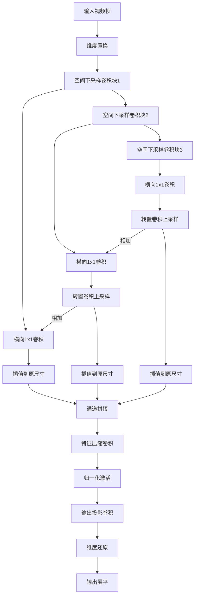

```mermaid
flowchart TD
    A[输入视频帧] --> B[维度置换]
    B --> C1[空间下采样卷积块1]
    C1 --> C2[空间下采样卷积块2]
    C2 --> C3[空间下采样卷积块3]
    
    C3 --> L1[横向1x1卷积]
    C2 --> L2[横向1x1卷积]
    C1 --> L3[横向1x1卷积]
    
    L1 --> U1[转置卷积上采样]
    U1 -->|相加| L2
    L2 --> U2[转置卷积上采样]
    U2 -->|相加| L3
    
    L3 --> F1[插值到原尺寸]
    U2 --> F2[插值到原尺寸]
    U1 --> F3[插值到原尺寸]
    
    F1 --> CONCAT[通道拼接]
    F2 --> CONCAT
    F3 --> CONCAT
    
    CONCAT --> FS1[特征压缩卷积]
    FS1 --> FS2[归一化激活]
    FS2 --> FS3[输出投影卷积]
    
    FS3 --> OUT[维度还原]
    OUT --> FINAL[输出展平]
```